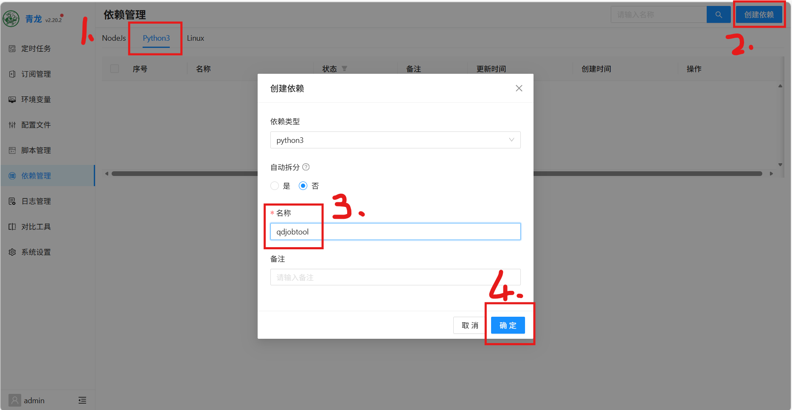
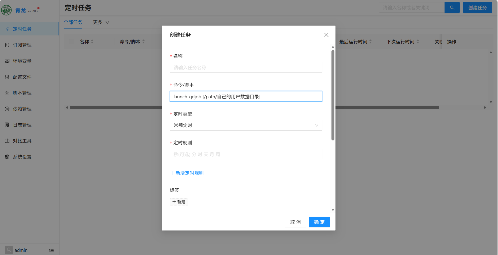
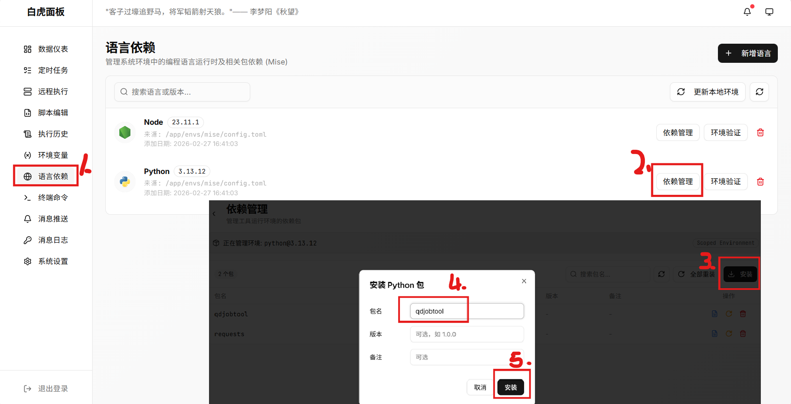
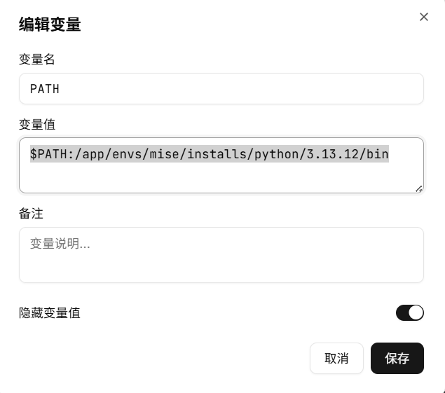
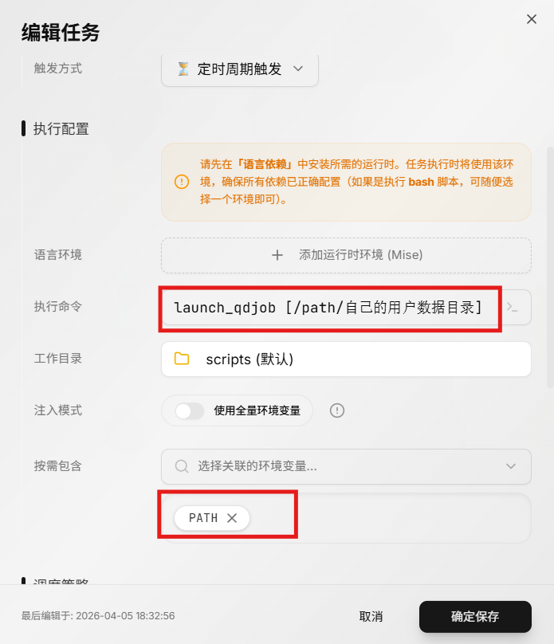

# 面板使用教程

**说明**：依赖与当前PyPi上的`qdjobtool`包，他只支持Linux amd64架构，使用前需要确认面板服的宿主机架构是否符合

## 青龙面板使用

> 作者没有青龙面板，靠经验猜测，如有问题欢迎指正

### 1. qinglong-添加依赖

按照图示步骤为面板python环境安装 `qdjobtool` 依赖

### 2. qinglong-添加任务

在定时任务菜单下添加任务

【命令/脚本】一栏填写`launch_qdjob [/path/自己的用户数据目录]`,注意将`[/path/自己的用户数据目录]`换成自己真实的`config.json`配置所在文件夹

其他项目按需填写

## 白虎面板

### 1. baihu-添加依赖

按照图示步骤为面板python环境安装 `qdjobtool` 依赖

### 2. baihu-编辑环境变量

由于白虎面板默认没有给python下bin目录添加相关环境变量，所以需要自己补充

在【环境变量】菜单下，点击【新建变量】。变量名为`PATH`,对应值填写`$PATH:/app/envs/mise/installs/python/3.13.12/bin`

### 2. baihu-添加任务

选择【定时任务】菜单下的【新建任务】按钮，点击添加新的任务

【执行命令】一栏填写`launch_qdjob [/path/自己的用户数据目录]`,注意将`[/path/自己的用户数据目录]`换成自己真实的`config.json`配置所在文件夹

【按需包含】一栏选择上一步设置的`PATH`环境变量进行绑定

其他项目按需填写，【语言环境】可以不绑定

